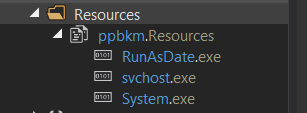
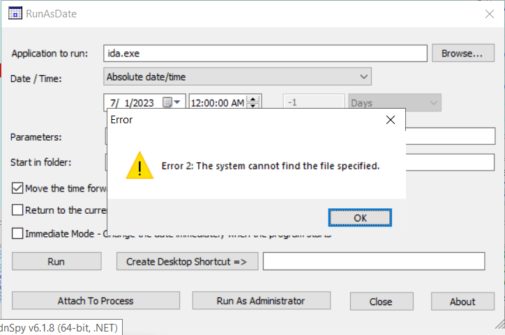
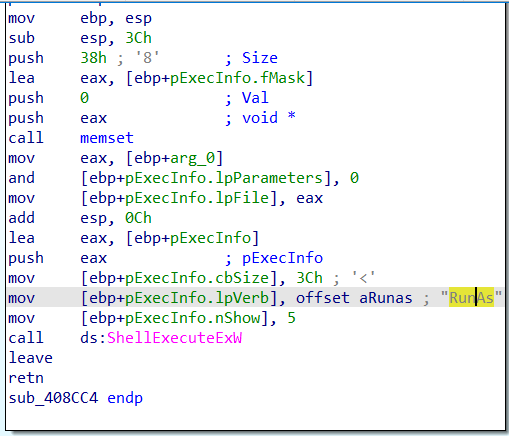
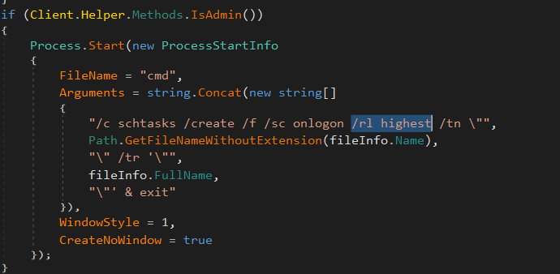
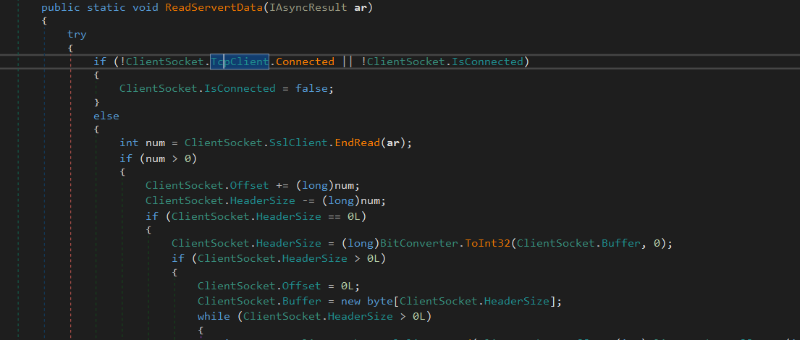
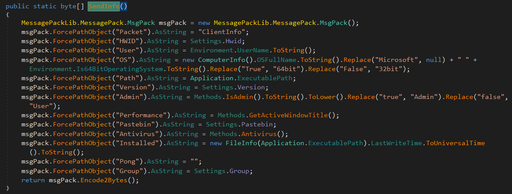

## First stage
### Basic static
i put the sample in peid to check if it is packed 
but it is not packed and it is a .net file

searching for any indicator i put it in peview 
let's see what we got

the sah265
>> 2BE793FBA87CD5DBC7D1C89F31E2FA18CA34BBAF27A624E09A10F9B962F55373

here is the string does not differ alot from the exports.
it is likely creating a mutex and try to make persistance 

### basic dynamic
now we will run it,
checking wireshark i got almost nothing important.
so i check process explorer first run there were many files and cmd opend.

checking procmon we can see it creats file at local/temp

there were a .bat file but it was deleted

now let's check the resources 

## advanced
first the malware create a mutex to make sure there is only one copy of it is runing

second it check if not an admin and if not it will use runas which is kind of privilage escalition to run it as administrator

after this all it will run WorkF methode,
from the first sight it's likely checking if a path exists and if not it creates it, then check if a file exists and if not it creates it.
stepping forward in the function we can see now it loops the resource files and trying to create the 3 files in the path it checks.

lets start debugging to check things deeper

runing dnsspy without admin permissions exit the program so runas somehow does not work in debugging mode

so i ran dnspy as admin to pass these few lines and execute the WorkF.

first few lines put 3 resource file in a list enum to loop them, then forward in the function it creates the first 2 at 
>AppData\Roaming
and extra 1 file

then the last resource file RunAsDate.exe we found before with procmon and likly the program run for the user when running the malware created withe extra some files at
 >AppData\Local\Temp

now we can see a bat file taking sometime before deleting itself again.

i took a copy for one of them and as you notice the names are different.

a new bat file is created and deleted every few seconds with diffrent names and the same content after i finish debugging and closed the RunAsDate.exe program that was running

so let's take a look on the content

it is pinging the localhost 10 times
then starts the boot.exe file witch was created by the malware, then delete itself

i tried to analyse the boot.exe but it was pretty much unreadable.
i tried with capa but nothing useful, so i searched with virustotal and it detected as a malicious but not sure what is the real purpose of it here.
so i will leave it for now and check the resources.

## Second stage

I copied the RunAsDate.exe file to work on it.

peid detected it is packed with UPX

so first i unpacked it using command
> upx -o the_real.exe -d RunAsDate.exe

now let's check in basic analysis first.
from virustotal i can say it is not malisious, there is only 5/96 detection 
with pestudio it's likely there nothing intersting here too, may be it is a normal program run for the user while the suspicious actions is running somewhere else in the background.

but we still checking it more with advanced analysis.

i found some intersting thing with the advanced analysis

when i run the program for debugging it is asking me to enter a file to execute but when i enterd a file like ida.exe it shows up a message saying can't find the specified file

while when i enterd a file created by the mawlare like System.exe or winstart.exe it does nothing.
meanwhile if i entered svchost.exe it stop responding

anyway this all may be because of missed functions as it is a part of the original sample, or a way to attract the user to click on run as adminstrator button at the buttom of the program,
so i just clicked it to see what does this do.

this executes a shell to run it as adminstration with runas which does not work before at the original file while debugging.

so may be this file is only for the gui and the privilage escalation.

checking the second file, svchost.exe from the analysis it turnes out that file is the file called boot.exe

let's check the third file System.exe

from the strings and basic analysis it seems do many suspicious actions and encrypting somthing as well as some network based actions.

let's start the advanced analysis.

at the top of the main function it check intialized settings which is encrypted usinf Aes256 algorithm
so i start debugging to decrypt them,

key

ports

hosts

version 

install

mutex

pastbin

anti

BDos

Group

Hwid

after those are decrypted it calls a function called verfyHash,
this method is computing the sha256 for the ServerCertificate which was encrypted using both aes256 and base64 just before the verfyHash function.

it is most likely checking if there is no modifications

then check if mutex is created, my case is not created so it exit the program while debugging
how ever it will be easy to patch the program to skip this condition.

next an anti-analysis method RunAntiAnalysis, it detects 4 things:

1. Manufacturer
2. Debugger
3. Sandboxie
4. small Disk size
5. windows xp

let's check each one.

Manufacturer

it searchs for (VIRTUAL, vmware, VirtualBox) from win32_computersystem which is a computer system running the Windows operating system

Debugger

checks if the process is attached to a debugger using CheckRemoteDebuggerPresent method which take a process handel as a parameter.

SandBoxie

this is detected if the SbieDll.dll exists

Small disk size

it gets the system directory size and comapre it with a fixed number and if it is less then it detected as small.

Windows Xp

it checks the OSname if contains an 'xp'

then the method install

first the method create the file winstart at AppData folder

then check if the current process is the same name as the file created and if they are not the same it will kill every process with the winstart.exe name

then it check if it is being run as admin and if true it will run a cmd command that set a scheduled task that runs the file at logon with the highest privilage

and if not admin it will put it in a Registry Key `Run` 

then using StreamFile it will create the .bat file we saw before and fill it with the content.

then it checks if the BDos and IsAdmin is true it calls Client.Helper.ProcessCritical.Set() function

set method call EnterDebugMode function we use this function because Some operating system processes run in a special mode. Attempting to read properties of or attach to these processes is not possible unless you have called EnterDebugMode on the component.
then it sets the process as critical which termination of any of them forces the system to reboot.

it seems to be used for previnting the process from termination

in the next few lines is the connection with the C2

first it checks if the client is not connected and if true it will call Reconnect.

the method establish the connection and call dispose method after each step

there is 3 more functions one for reading the data from the server, and another for sending, and the last for KeepAlivePacket

last thing it calls InitializeClient method

this method establish a tcp connection from the client side using informations provided with intialized settings we saw before

if connection is done it sends all these informations to the server

then start reading from the server.

the connection is secured using ssl protocol

and this is the end of the file.

